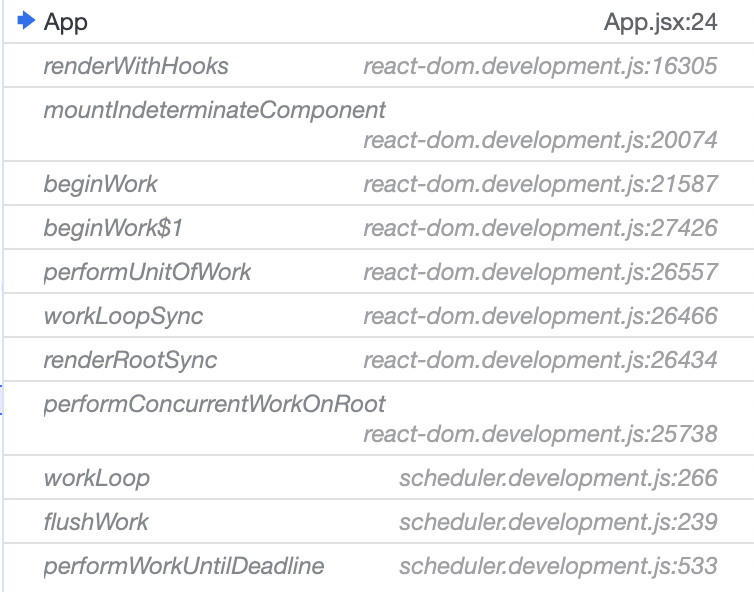
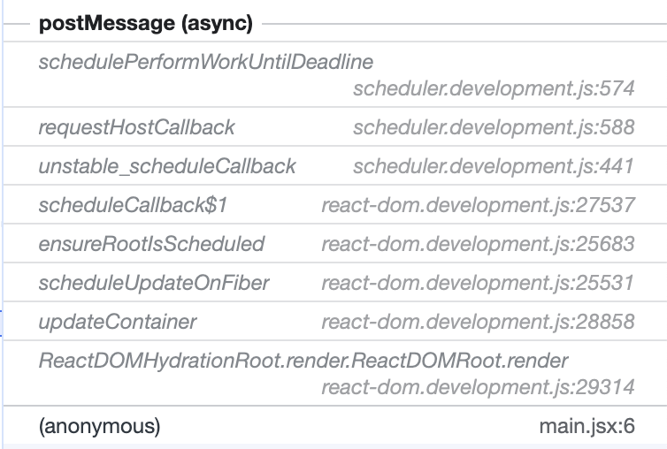

# React Fiber

## Brief Overview of React Fibers

React Fiber is the new reconcilier that was created from scratch starting from `React 16` in order to overcome the shortcomings of using the javascript call stack (which I will soon speak of in an article). React fiber came into place for these four reasons:
- Pause a work and come back to it later
- Assign priority to different types of work
- Reuse previously completed work
- Abort work if it's no longer needed

💫 ***What is exaclty fiber at implementation level?***

A fiber is simply a javascript object that contains information about React elements and components, such as the type of the element, the key, the props passed to the given element, etc.

Fibers are also considered as a ***unit of work*** and give priorities to the different units of work so that they are executed based on their priorities. The priorities are defined in [SchedulerPriorities.js](https://github.com/facebook/react/blob/main/packages/scheduler/src/SchedulerPriorities.js):
-  `0`: NoPriority
-  `1`: ImmediatePriority
-  `2`: UserBlockingPriority
-  `3`: NormalPriority
-  `4`: LowPriority
-  `5`: IdlePriority

Except NoPriority, the priorities are mentioned in a descending order. ImmediatePriority can be something related to a UI interaction and needs to be executed immediately for a great user experience. Some other tasks can wait until the main thread is idle and can be executed by then. 

## 🏃‍♂️ To Debugging ##

This app codebase is used for debugging fiber's data structure and the different functions involved in the reconciliation. 

The app is very simple, created using `Vite`, I just created a component `MyButton` and used it in the App so that when clicked, it increments a counter.

This app is rendered by:

- `createRoot()`
- `react-dom@18.2.0`

The image below demonstrates the component tree of this app:


Which contains the App component, the div which contains two images, one of `React` and the other of `Vite`, `h1` the header which contains the title `Vite + React`, and finally the `MyButton` component which wraps `button`.

Now let's look at the fiber's tree, which displays only 3 host elements:


`<div>`, `h1`, and `<button>`, which are the parents of each subtree. We also see that `MyButton` component, which is a wrapper of `button`is not shown in the fiber tree, and instead, `button` is shown directly. If we expand the button element, we get to see  the following:


- `__reactFiber$hwiy9k0i6jt`: which is the fiber corresponding to the button element.
FiberNode `{tag: 5, key: null, elementType: 'button', type: 'button', stateNode: button, …}`
- `__reactProps$hwiy9k0i6jt`:  which is the properties passed to the fiber, and in this case, it is the onClick, and count.
`{children: Array(2), onClick: ƒ}`.


## Description of the content of the fiber tree

The fiber node in `__reactFiber$hwiy9k0i6jt` of the `MyButton` component contains the following properties:
- `tag`: It is a number that represents the type of the fiber. For instance, `5` means a DOM element, `6` a text node, and here is the entire list from [react describeFibers.js](https://github.com/facebook/react/blob/432b9f1d9729aaea010730d546bda89b9842eaa1/fixtures/fiber-debugger/src/describeFibers.js#L12):
    - `0`: Indeterminate
    - `1`: Function component
    - `2`: Class component
    - `3`: The root of the host component (Eg, App, the root of the react App)
    - `4`: A Portal
    - `5`: A host component (a DOM element)
    - `6`: A text element
    - `7`: Caroutine
    - `8`: Handler
    - `9`: Yield
    - `10`: Fragments

- `key`: It is the same key used to uniquely identify elements in React during reconciliation. In this example, it is `null` since no key was used.

- `elementType`: It represents the original type of the React element as the user defines it, such as function components, class components, a special React type such as Fragmenet, or string with the HTML tag name for host elements. 
- `type`: It is used when `type` needs to be modified or resolved in order to reperesent the latest version of `type` in hot-reloading environments. Example of why `elementType` is used:
    ```
    // Original component
    function MyComponent() {
        // ...
        }

    // Usage in the app
    const element = <MyComponent />;
    ```
Let's say `MyComponent` is updated and you perform hot-reloading,  `type` might still refer to the old version of `MyComponent`, and hence `elementType` is used to resolve `type` during hot-reloading.
- `stateNode`: It refers to the actual component instance or the DOM element. In this case, it refers to the button element in the DOM.


We expend further the `__reactFiber$hwiy9k0i6jt` and we obtain more details about the fiber node:

```
__reactFiber$hwiy9k0i6jt: FiberNode
  actualDuration: 0.19999998807907104
  actualStartTime: 1340
  alternate: null
  child: FiberNode {tag: 6, key: null, elementType: null, type: null
  stateNode: text, …}
  childLanes: 0
  deletions: null
  dependencies: null
  elementType: "button"
  flags: 0
  index: 0
  key: null
  lanes: 0
  memoizedProps: {children: Array(2), onClick: ƒ}
  memoizedState: null
  mode: 27
  pendingProps: {children: Array(2), onClick: ƒ}
  ref: null
  return: FiberNode {tag: 0, key: null, stateNode: null, elementType: ƒ, type: ƒ, …}
  selfBaseDuration: 0
  sibling: null
  stateNode: button
  subtreeFlags: 1048576
  tag: 5
  treeBaseDuration: 0
  type: "button"
  updateQueue: null
  _debugHookTypes: null
  _debugNeedsRemount: false
  _debugOwner: FiberNode {tag: 0, key: null, stateNode: null, elementType: ƒ, type: ƒ, …}
  _debugSource: {fileName: 'react-fiber/src/components/MyButton.jsx', lineNumber: 4, columnNumber: 12}
  [[Prototype]]: Object
__reactProps$hwiy9k0i6jt: 
children: Array(2)
  0: "count is "
  1: 0
  length: 2
  [[Prototype]]: Array(0)
onClick: ƒ updateCounter()
  length: 0
  name: "updateCounter"
  prototype: {constructor: ƒ}
  arguments: (...)
  caller: (...)
  [[FunctionLocation]]: App.jsx:9`
```

- `actualDuration`: It is the total time in ms spent in order to render the component and its descentdents.
- `actualStartTime`: It is the timestamp in ms when the rendering of the component started.

These information could be used in **performance profiling**. Let's continue with the other fiber data:

- `alternate`: It is the alternate version representing the new state of the tree. In this case it is null because we have the initial render and nothing triggered a change in the state, and hence no re-render is triggered. After clicking on the button to increment the counter, the counter value becomes 1, the state will be updated and a re-render is triggered. The alternate value becomes:

```
alternate: FiberNode
actualDuration: 0.09999999403953552
actualStartTime: 49094.09999999404
alternate: FiberNode {tag: 5, key: null, elementType: 'button', type: 'button', stateNode: button, …}
child: FiberNode {tag: 6, key: null, elementType: null, type: null, stateNode: text, …}
childLanes: 0
deletions: null
dependencies: null
elementType: "button"
flags: 4
index: 0
key: null
lanes: 0
memoizedProps: 
  children: Array(2)
  0: "count is "
  1: 1
  length: 2
.
.
.
```
- `child`: It points to the child of the button fiber, and in this case, it is the text node which has as value "count is" plus the counter value.
- `childLanes`: Lanes in React are a concept related to scheduling and concurrent mode. A lane is a way to mark work with priority, and in this case is `0` which indicates no specific priority. It is associated with a subtree of the fiber node.
- `deletions`: It represents any nodes marked for deletion during the most recent update, and in this case it is `null`.
- `dependencies`: It is related to the concurrent mode and tracking asynchronous updates. In this case, it is `null`.
- `flags`: They are used for internal bookkeeping. `0` means no flag is set.
- `index`: It represents the index of the fiber node in the parent's child list. 
- `lanes`: similar to `childLanes`.
- `memoizedProps`: It contains the props that were commited to the fiber in the last update. (In this example, it is an array of two values: `count is`, and `0` before clicking the button, and has `onClick` for the function `updateCounter).
       -  children:Array(2)
           0: "count is "
           1: 0
           length: 2
           [[Prototype]]: Array(0)
       -  onClick: ƒ updateCounter()
           length: 0
           name: "updateCounter"  
- `memoizedState`: It contains the state of the component that was commited in the last render.
- `mode`: It represents the rendering mode (Eg. `ConcurrentMode`)
- `pendingProps`: It contains the props which are about to be committed.
       -  children:Array(2)
           0: "count is "
           1: 0
           length: 2
           [[Prototype]]: Array(0)  
       -  onClick: ƒ updateCounter()
           length: 0
           name: "updateCounter"  
- `ref`: Is is `ref` used in a react elements, it indicates a reference to the underlying instance of a given component in order to access it or it underlying DOM element. In this example, it is `null` because ref was not attached to the `MyButton` component.           
- `return`: It points to the fiber parent node in the tree.  
- `selfBaseDuration`: It is the time the component takes to render itself, without its children.
- `sibling`: It points to the next sibling of the child of the fiber node. In this case it is `null` because only `button` is returned and it has no other siblings returned with it.
- `subtreeFlags`: It indicates some flags related to the subtree.
- `treeBaseDuration`: It is the time the component takes to render itself and its children.
- `updateQueue`: It contains the pending updates for the fiber node, used to manage state and props updates.

For more, check [React Fiber source code](https://github.com/facebook/react/blob/432b9f1d9729aaea010730d546bda89b9842eaa1/packages/react-reconciler/src/ReactFiber.js)

## Call stack before button click




1. `ReactDOMHydrationRoot.render.ReactDOMRoot.render`: Both `ReactDOMHydrationRoot.prototype` and `ReactDOMRoot.prototype` are assigned the `render` function. This function takes the react elements that are being rendered, and it calls the next method `updateContainer`.`ReactDOMRoot` reperesents a root instance created by `ReactDOM.createRoot` while `ReactDOMHydrationRoot` represents a root instance created with the `hydrate` option. For more, you can check the source code of this function in [ReactDOMRoot.js](https://github.com/facebook/react/blob/6c7b41da3de12be2d95c60181b3fe896f824f13a/packages/react-dom/src/client/ReactDOMRoot.js#L246).
2. `updateContainer`: This function schedules updates of the content of a container with a new React element on the fiber tree by calling `scheduleUpdateOnFiber`. For more, check [ReactFiberReconciler.js](https://github.com/facebook/react/blob/6c7b41da3de12be2d95c60181b3fe896f824f13a/packages/react-reconciler/src/ReactFiberReconciler.js)
3. `scheduleUpdateOnFiber`: This function as it names indicates, is responsible for scheduling an update on specific fiber given a fiber root. For more, check [ReactFiberWorkLoop.js](https://github.com/facebook/react/blob/6c7b41da3de12be2d95c60181b3fe896f824f13a/packages/react-reconciler/src/ReactFiberWorkLoop.js#L720)
4. `ensureRootIsScheduled`: This function is called when a root receives an update. It ensures that the root is in the root schedule, and that there is a pending microtask to process the root schedule. For more, check [ReactFiberRootScheduler.js](https://github.com/facebook/react/blob/6c7b41da3de12be2d95c60181b3fe896f824f13a/packages/react-reconciler/src/ReactFiberRootScheduler.js) 
5. `scheduleCallback$1`: It looks like a variant of `scheduleCallback`. I didn't find it in the source code of react. From the browser:
````
function scheduleCallback$1(priorityLevel, callback) {
  {
    // If we're currently inside an `act` scope, bypass Scheduler and push to
    // the `act` queue instead.
    var actQueue = ReactCurrentActQueue$1.current;

    if (actQueue !== null) {
      actQueue.push(callback);
      return fakeActCallbackNode;
    } else {
      return scheduleCallback(priorityLevel, callback);
    }
  }
}
````
It basically checks if the app is running in an `act` scope and adjusts the scheduling accordingly.
6. `unstable_scheduleCallback`: This is a core function of the [Scheduler.js](https://github.com/facebook/react/blob/main/packages/scheduler/src/forks/Scheduler.js).It schedules a callback for a given task taking into account the task's priority, the start time, and the delay of the task when it can be delayed. It enqueues tasks in the ***timer queue*** when the start time is greater than the current time, and enqueues them in the ***tasks queue*** otherwise. If all tasks are delayed, a host timeout is scheduled. A host callback is scheduled otherwise. 
7. `requestHostCallback`: This function is called in the previous function `unstable_scheduleCallback` indicating that this task is not  delayed, and it is picked from the `task queue`. This function is is also part of the `Scheduler`, and it basically starts the `messageLoop` of the `Scheduler` and runs the next method `schedulePerformWorkUntilDeadline`.
8. `schedulePerformWorkUntilDeadline`: Also part of the `Scheduler`, and it chooses the best available native scheduling method in the browsers to schedule callbacks. It favors `setImmediate` since it runs right as early as possible after the current event loop cycle, while `setTimeout` has a delay of minimum 4ms, and it's not convenient when timeouts are too small. `setImmediate` is supported in NodeJs and Internet Explorer only. Therefore, in a different environment, the scheduler searches if the browser supports `MessageChannel`, which is relatively modern and supported in DOM and worker environments, and it is also a scheduling mechanism.  
9. `postMessage`: During this experiment, I ran the app in a recent version of `Chrome`, and looks like `schedulePerformWorkUntilDeadline` picked `MessageChannel` as a scheduling mechanism, and it contains two ports and two methods: `onMessage`and `postMessage`. `onMessage` is the event handler and it runs the next function called in the stack `performWorkUntilDeadline`. `postMessage` is used to send messages between the ports, so it basically sends a method through `MessageChannel` to notify that there is a message to be processed. 
10. `performWorkUntilDeadline`: This is also part of the `Scheduler` and it is run in `onMessage`. It is run when the scheduler `MessageLoop` is running, and checks if there is more work to do, it will call the next function `flushWork`, and will call `schedulePerformWorkUntilDeadline` to schedule the next task. When there is no more work, it will stop the `MessageLoop` and will yield control to the browser main thread. 
11. `flushWork`: It is also part of the `Scheduler`. It initiates the `workLoop` function.
12. `workLoop`: Also part of the `Scheduler`. This function is responsible for executing the tasks, and it uses inside it the `advanceTimers` function.  This method makes sure it doesn't exceed the frame interval of the browser, and it yields control to the browser in that case. This method also checks if a callback is a continuation callback, which signals to the scheduler if a task is big so that it will continue execution in later iterations. When a continuation callback is returned, this continuation callback is assigned to the current task's callback, and the scheduler yields back control to the main thread, regardless of how much time is left in the current time slice. This mechanism is used to break large tasks into smaller units and maintain a responsive UI. 
13. `performConcurrentWorkOnRoot`: This function is part of the [ReactFiberWorkLoop.js](https://github.com/facebook/react/blob/c17a27ef492d9812351aecdfb017488e8e8404ce/packages/react-reconciler/src/ReactFiberWorkLoop.js#L886). It is a core function in the rendering process, handling both **concurrent** and **synchronous** rendering, error recovry, and scheduling future updates. This function disables time slicing for blocked and long situations (such as expired lanes or when the work has been CPU-bound for too long), and it is enabled otherwise in order to improve the responsiveness of the application. When time slicing is enabled, this function performs a concurrent rendering by calling `renderRootConcurrent`, and when disabled, it is disabled, this function performs syncronous rendering by calling `renderRootSync`.
14. `renderRootSync`: Also part of `ReactFiberWorkLoop.js`. React team is thinking of unifying this function with `renderRootConcurrent` since their code is similar. It is responsible for rendering syncronously by calling the core method `workLoopSync`. 
15. `workLoopSync`: Also part of `ReactFiberWorkLoop.js`. It basically runs a while loop as long as there is still work to do, without checking if there is need to yield between fibers, and calls within that loop the function `performUnitOfWork`. 
16. `performUnitOfWork`: Also part of `ReactFiberWorkLoop.js`, and takes as argument a fiber. It calls within it the function `beginWork`, and the work is performed on the alternate fiber. The fiber's pending props are updated in the fiber's memoized props, and checks if no next fiber to work on (i.e when `beginWork` returns null), `completeUnitOfWork` will be called, the next fiber from the fiber tree will be handled otherwise.
17. `beginWork$1`:
18. `beginWork`:
19. `mountIndeterminateComponent`:
20. `renderWithHooks`:
 

## Call stack on button click

When we click the button, the counter will be incremented, I tracked the stack on the browser, and here are the different functions that were called:


1. `flushSyncCallbacks`:
2. `performSyncWorkOnRoot`:
3. `renderRootSync`:
4. `workLoopSnyc`:
5. `performUnitOfWork`:
6. `beginWork$1`:
7. `beginWork`:
8. `updateFunctionComponent`:
9. `renderWithHooks`:

